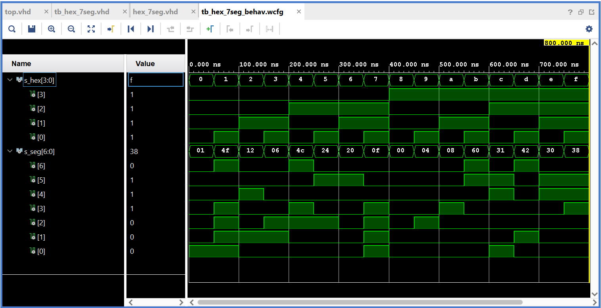

# Lab 4: Daniel Smyd

### Seven-segment display decoder

1. Listing of VHDL stimulus process from testbench file (`tb_hex_7seg.vhd`) with asserts. Verify all input combinations. Always use syntax highlighting, meaningful comments, and follow VHDL guidelines:

```vhdl
    p_stimulus : process
    begin
        report "Stimulus process started" severity note;

        -- First test case
        s_hex <= "0000"; wait for 50 ns; -- 0
        assert (s_seg = "0000001")
        report "Input combination 0000 FAILED" severity error;

        s_hex <= "0001"; wait for 50 ns; -- 1
        assert (s_seg = "1001111")
        report "Input combination 0001 FAILED" severity error;

        s_hex <= "0010"; wait for 50 ns; -- 2
        assert (s_seg = "0010010")
        report "Input combination 0010 FAILED" severity error;

        s_hex <= "0011"; wait for 50 ns; -- 3
        
        s_hex <= "0100"; wait for 50 ns; -- 4
        assert (s_seg = "1001100")
        report "Input combination 0100 FAILED" severity error;

        s_hex <= "0101"; wait for 50 ns; -- 5   
        
        s_hex <= "0110"; wait for 50 ns; -- 6
        
        s_hex <= "0111"; wait for 50 ns; -- 7
        
        s_hex <= "1000"; wait for 50 ns; -- 8
        
        s_hex <= "1001"; wait for 50 ns; -- 9
        
        s_hex <= "1010"; wait for 50 ns; -- A (10)
        
        s_hex <= "1011"; wait for 50 ns; -- b (11)
        
        s_hex <= "1100"; wait for 50 ns; -- C 
        
        s_hex <= "1101"; wait for 50 ns; -- d
        
        s_hex <= "1110"; wait for 50 ns; -- E
        
        s_hex <= "1111"; wait for 50 ns; -- F

        report "Stimulus process finished" severity note;
        wait;
    end process p_stimulus;
```

2. Screenshot with simulated time waveforms. Always display all inputs and outputs (display the inputs at the top of the image, the outputs below them) at the appropriate time scale!

   

### LED(7:4) indicators

1. Listing of LEDs(7:4) part of VHDL architecture from source file `top.vhd`. Try to write logic functions as simple as possible. Always use syntax highlighting, meaningful comments, and follow VHDL guidelines:

   ```vhdl
   --------------------------------------------------------------------
   -- Experiments on your own: LED(7:4) indicators
   
   -- Turn LED(4) on if input value is equal to 0, ie "0000"
      LED(4) <= '1' when (SW = "0000")else '0';

   -- Turn LED(5) on if input value is greater than "1001", ie 10, 11, 12, ...
      LED(5) <= '1' when (SW > "1001")else '0';
      
   -- Turn LED(6) on if input value is odd, ie 1, 3, 5, ...
      LED(6) <= '1' when (SW(0) = '1')else '0';
 
   -- Turn LED(7) on if input value is a power of two, ie 1, 2, 4, or 8
      LED(7) <= '1' when (SW = "0001" or SW = "0010" or SW = "0100" or SW = "1000")else '0';
   
   ```
